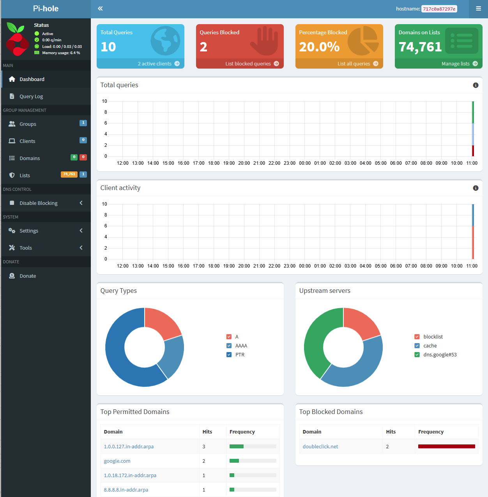
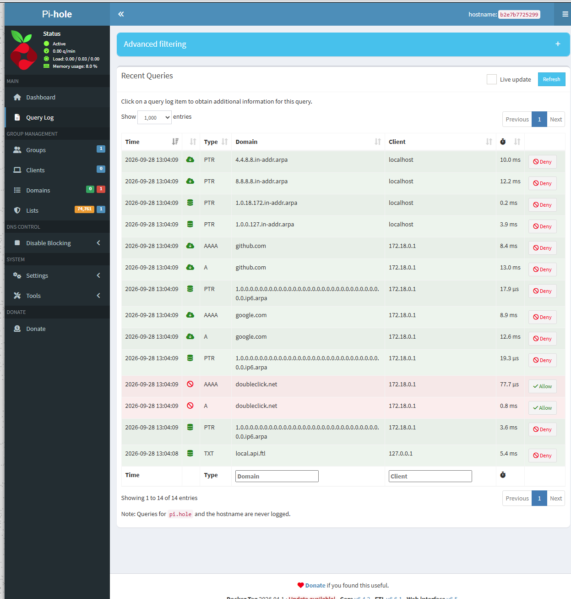
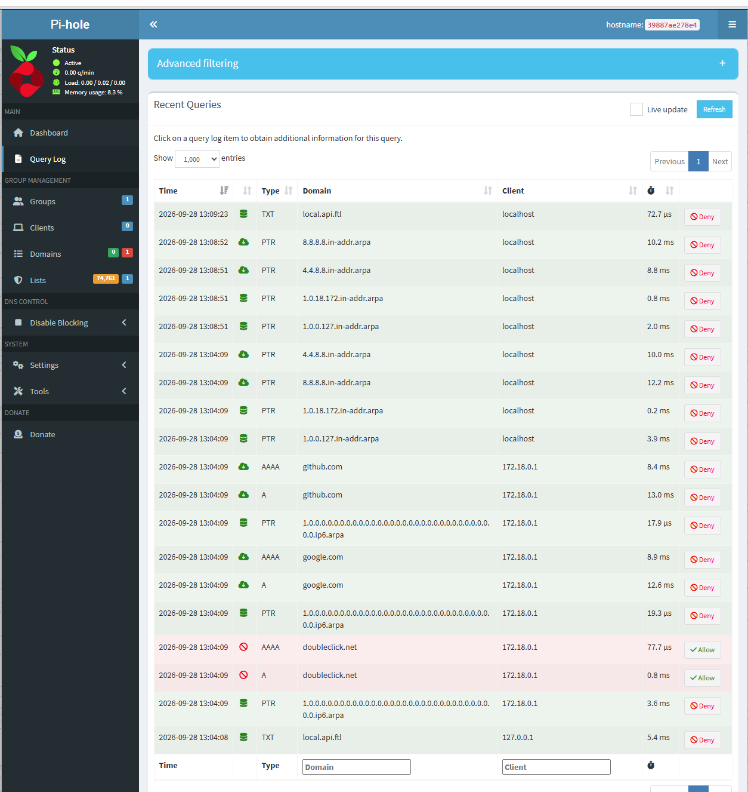

# Pi-hole in Docker



Network-wide DNS ad/tracker blocker, run as a container from the official
`pihole/pihole` image. No custom code: this project is about **pulling and
configuring an existing image** (Compose, environment variables, ports,
persistent volumes, secrets via `.env`).

## What it demonstrates

* Pulling and configuring a third-party image from Docker Hub
* DNS in practice: a container answering DNS queries on port 53
* Secrets kept out of Git (`.env` + `.env.example`)
* A **named volume** for persistent state, with a way to inspect it
* Port mapping choices (web UI on 8080 to avoid conflicts)

## Run it

```bash
cp .env.example .env        # PowerShell: Copy-Item .env.example .env
# edit .env and set PIHOLE\_PASSWORD
docker compose up -d
```

Admin UI: http://localhost:8080/admin

## Test that it works

Query Pi-hole directly as the DNS server:

```powershell
nslookup google.com 127.0.0.1          # should resolve normally
nslookup doubleclick.net 127.0.0.1     # ad domain: should return 0.0.0.0 (blocked)
```

Then open the dashboard and watch the queries appear in the query log.

## Inspect the persistent volume

```powershell
docker volume ls
docker run --rm -v pihole-docker-project\_pihole\_data:/data alpine ls -la /data
```

(The volume name is prefixed with the project folder name. Confirm it with
`docker volume ls`.)

## Troubleshooting

* **Port 53 already in use:** change `"53:53/tcp"` and `"53:53/udp"` to
`"5353:53/tcp"` and `"5353:53/udp"`, then test with
`nslookup -port=5353 google.com 127.0.0.1`.
* **Forgot the password:** `docker exec -it pihole pihole setpassword`

## Stop / clean up

```bash
docker compose down        # stops and removes the container, keeps the volume
docker compose down -v     # also deletes the volume (config + stats)
```

## Note

This runs Pi-hole for local testing. Pointing your router or other devices at
it is a separate step; only do that once you're happy it works, because if the
container is down, those devices lose DNS.

## Upgrading. 

This project has been tested upgrading from Pi-hole 2026.04.1, Core 6.4.2, FTL 6.6.1, to 2026.07.2, Core 6.4.3, FTL 6.7, on the same named volume. Deny list entries, the blocklist, and query history all survived the upgrade. This was a minor version upgrade, not a major schema change, so treat larger jumps with more caution. Before upgrading, back up the volume: `docker run --rm -v pihole-docker-project_pihole_data:/data -v ${PWD}:/backup alpine tar czf /backup/pihole_backup.tgz -C /data .` Then update the image tag in docker-compose.yml and run `docker compose up -d` to pull and restart. To restore from a backup if something goes wrong: `docker run --rm -v pihole-docker-project_pihole_data:/data -v ${PWD}:/backup alpine tar xzf /backup/pihole_backup.tgz -C /data`.

**Before upgrade (Pi-hole 2026.04.1):**



**After upgrade (Pi-hole 2026.07.2):**


