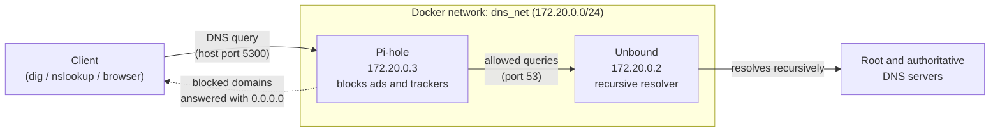
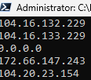
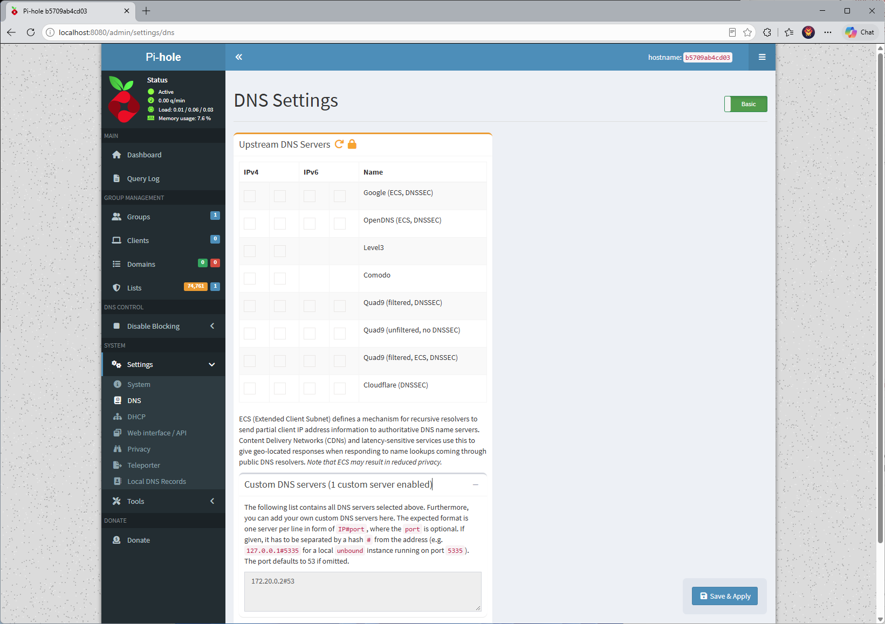
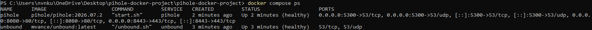

# Pi-hole + Unbound in Docker


A network-wide DNS ad/tracker blocker ([Pi-hole](https://pi-hole.net/)) that
forwards its queries to its own **recursive DNS resolver** ([Unbound](https://nlnetlabs.nl/projects/unbound/)),
instead of handing every lookup to Google or Cloudflare. Both run as
containers on a private Docker network, defined in a single Compose file.

No custom code: this project is about **pulling, wiring together and
operating existing images** (Compose, networking, healthchecks, environment
variables, persistent volumes, secrets via `.env`).

## Architecture



**How a lookup flows:** the client asks Pi-hole. If the domain is on a
blocklist, Pi-hole answers `0.0.0.0` straight away. Otherwise it forwards the
query to Unbound, which resolves it itself rather than relying on a third-party
DNS provider. Unbound is not published to the host at all; it is only
reachable from inside the Docker network.

## What it demonstrates

* Pulling and configuring third-party images from Docker Hub
* DNS in practice: a container answering DNS queries and another resolving them recursively
* A **custom bridge network** with fixed IP addresses for each service
* **Healthchecks** and `depends_on: condition: service_healthy`, so Pi-hole only starts once Unbound is answering
* Restart policies (`unless-stopped`) and a **pinned image tag** for Pi-hole
* Secrets and settings kept out of Git (`.env` + `.env.example`)
* A **named volume** for persistent state, with a way to inspect and back it up
* Port mapping choices (web UI on 8080, DNS on 5300 for Windows hosts)

## Run it

```bash
cp .env.example .env        # PowerShell: Copy-Item .env.example .env
# edit .env and set PIHOLE_PASSWORD
docker compose up -d
docker compose ps           # both containers should become "healthy"
```

Admin UI: http://localhost:8080/admin

### Configuration (`.env`)

| Variable | Purpose | Example |
| --- | --- | --- |
| `TZ` | Container time zone | `Australia/Melbourne` |
| `PIHOLE_PASSWORD` | Pi-hole admin password (never commit this) | `change-me` |
| `PIHOLE_WEB_PORT` | Host port for the admin UI (optional, defaults to 8080) | `8080` |
| `DNS_SUBNET` | Subnet of the private Docker network | `172.20.0.0/24` |
| `UNBOUND_IP` | Fixed IP of the Unbound container | `172.20.0.2` |
| `PIHOLE_IP` | Fixed IP of the Pi-hole container | `172.20.0.3` |

Pi-hole is pointed at Unbound through `FTLCONF_dns_upstreams`, built from
`UNBOUND_IP`.

### Note for Windows hosts (why DNS is on port 5300)

Windows already uses port 53 for its own services, and UDP 5353 is reserved
for mDNS, so this project publishes Pi-hole's DNS on **host port 5300**
(`5300:53`). Inside Docker the containers still talk on port 53. On a Linux
host you can change the mapping back to `53:53` and point devices at it
directly.

## Test that it works

Run the checks from inside the Pi-hole container. This works on any host and
proves the whole chain (PowerShell needs the quotes around the `@` argument):

```powershell
docker exec pihole dig "@127.0.0.1" cloudflare.com +short   # resolves normally
docker exec pihole dig "@127.0.0.1" doubleclick.net +short  # ad domain: returns 0.0.0.0 (blocked)
docker exec pihole dig "@172.20.0.2" example.com +short     # Pi-hole's network reaches Unbound directly
```



From the Windows host you can also query the published port:

```powershell
nslookup -port=5300 google.com 127.0.0.1
```

Both containers should report `healthy`:



In the admin UI under **Settings > DNS**, the only upstream server is Unbound
(`172.20.0.2#53`). The padlock means the value is set by the Compose file's
environment variable:



## Inspect the persistent volume

```powershell
docker volume ls
docker run --rm -v pihole-docker_pihole_data:/data alpine ls -la /data
```

(The volume name is prefixed with the Compose project name. Confirm it with
`docker volume ls`.)

## Troubleshooting

* **Port already in use:** change the host side of the DNS mapping in
  `docker-compose.yml` (for example `"5301:53/tcp"` and `"5301:53/udp"`) and
  test with `nslookup -port=5301 google.com 127.0.0.1`.
* **Unbound shows `unhealthy`:** check `docker logs unbound`. Pi-hole will not
  start until Unbound is healthy.
* **Forgot the password:** `docker exec -it pihole pihole setpassword`
* **Blank values or a network error on startup:** make sure your `.env`
  contains every variable in the table above.

## Stop / clean up

```bash
docker compose down        # stops and removes the containers, keeps the volume
docker compose down -v     # also deletes the volume (config + stats)
```

## Note

This runs Pi-hole for local testing. Pointing your router or other devices at
it is a separate step; only do that once you're happy it works, because if the
container is down, those devices lose DNS.

## Upgrading

Before the Unbound extension, this project was tested upgrading Pi-hole from
2026.04.1 (Core 6.4.2, FTL 6.6.1) to 2026.07.2 (Core 6.4.3, FTL 6.7) on the
same named volume. Deny list entries, the blocklist and query history all
survived the upgrade. This was a minor version upgrade, not a major schema
change, so treat larger jumps with more caution.

Before upgrading, back up the volume (the `.tgz` backup is git-ignored):

```powershell
docker run --rm -v pihole-docker_pihole_data:/data -v ${PWD}:/backup alpine tar czf /backup/pihole_backup.tgz -C /data .
```

Then update the image tag in `docker-compose.yml` and run `docker compose up -d`
to pull and restart. To restore from a backup if something goes wrong:

```powershell
docker run --rm -v pihole-docker_pihole_data:/data -v ${PWD}:/backup alpine tar xzf /backup/pihole_backup.tgz -C /data
```

**Before upgrade (Pi-hole 2026.04.1):**


**After upgrade (Pi-hole 2026.07.2):**


